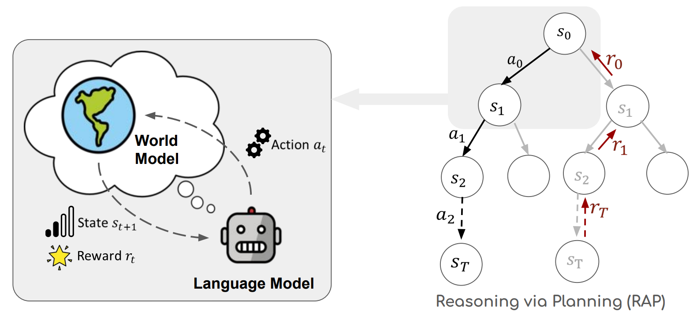

# RAP: Reasoning via Planning
Source code for the paper [Reasoning with Language Model is Planning with World Model](https://arxiv.org/abs/2305.14992)


# Requirements

- Our experiments are conducted with LLaMA-33B, which takes at least 4 GPUs of 24GB memory each. The code also supports smaller LLaMA models, but other LLMs (e.g. those from Hugging Face) are not tested.

- All required packages for [LLaMA official repo](https://github.com/facebookresearch/llama).

- (For Blocksworld) All required packages for [GPT-Plan-Benchmark](https://github.com/karthikv792/gpt-plan-benchmark).

# Start
- Acquire the checkpoints of LLaMA from MetaAI following the [LLaMA official repo](https://github.com/facebookresearch/llama) and set up the environment variable: ```export LLAMA_CKPTS="YOUR_PATH_TO_LLAMA_CHECKPOINTS"```

## Blocksworld
- Git clone the [GPT-Plan-Benchmark](https://github.com/karthikv792/gpt-plan-benchmark) and install required software.
- Export the path to the validator following GPT-Plan-Benchmark ```export VAL="YOUR_PATH_TO_VAL"```
- Run the command: ```CUDA_VISIBLE_DEVICES=0,1,2,3 python -m torch.distributed.run --master_port 1034 --nproc_per_node 4 run_blocksworld.py --task mcts --model_name LLaMA --ckpt_path $LLAMA_CKPTS/30B --verbose True --data data/blocksworld/step_4.json --max_depth 4 --name run_4_May26_max_depth_4_alpha_05_rollouts_10 --rollouts 10```

## GSM8k
- Run with: ```CUDA_VISIBLE_DEVICES=0,1,2,3 torchrun --nproc_per_node 4 --master-port 1054 run_gsm8k.py --llama-ckpt $LLAMA_CKPTS/30B --speedup-confidence-batch-size 2```
- Use `python run_gsm8k.py -- --help` for details about arguments
- For RAP-Aggregation, after running RAP on GSM8k, run `python aggregate_gsm8k.py --log-dir <log_dir>`

## ProntoQA
- Run with: ```CUDA_VISIBLE_DEVICES=0,1,2,3 torchrun --nproc_per_node 4 --master-port 1074 run_prontoqa.py --llama-ckpt $LLAMA_CKPTS/30B```
- Use `python run_prontoqa.py -- --help` for details about arguments

## Other datasets
To be updated...
